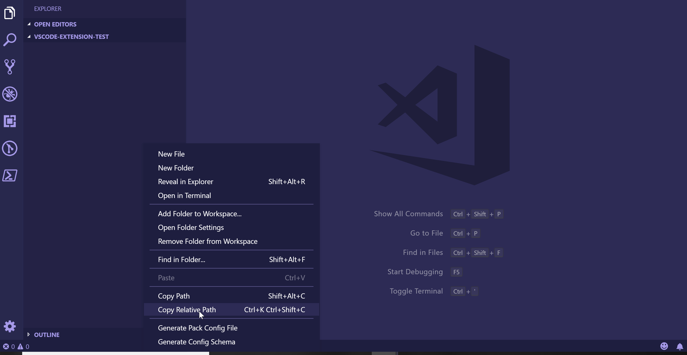

# Stackstorm VS Code

This extension adds the ability to create the required files for a Stackstorm pack in a VS Code Workspace.
 > Inspired by [VS Code Angular Files](https://github.com/ivalexa/vscode-angular2-files/)

## Disclaimer

This plugin is not an official Stackstorm plugin. It is not officially affiliated with Stackstorm.

## Features

### File Templates

Right click within the explorer to create:

*   Pack Config Template - `pack.yaml` file required for a pack.
*   Config Schema Template - `config.schema.yaml` file required if using config values within a pack.
*   Action Metadata Template - `action.yaml` file which is required to register a action with Stackstorm.
*   Workflow Metadata Template - `workflow.yaml` file which is used to describe a particular workflow.
*   Action Metadata Template - `action.yaml` file which is used to describe a particular rule.
*   Alias Metadata Template - `alias.yaml` file which is used to create action aliases.
*   Policy Template - `policy.yaml` file which is used to create stackstorm policies.
*   README Template - `README.md` file to describe the pack.
*   Rule Metadata Template - `rule.yaml` used to create rules within stackstorm.
*   Sensor Metadata Template - `senson.yaml` file used to create stackstorm sensors.

## Settings

Two settings can be set for use with this extension, they are:
*  `st2.defaultAuthor`. This setting is used to fill in the author section of the pack.yaml file. If this is not set, you will be prompted for an answer.
*  `st2.defaultEmail`. This setting is used to fill in the email section of the pack.yaml file. If this is not set, you will be prompted for an answer.

These settings can either be set via the settings page or via the settings.json file.

## Demo

## Note

This extension should not overwrite any files that already exist, however this is not a guarentee. I will not be help responsible for any data loss.

## Release Notes

Detailed change log can be found [here](CHANGELOG.md).
